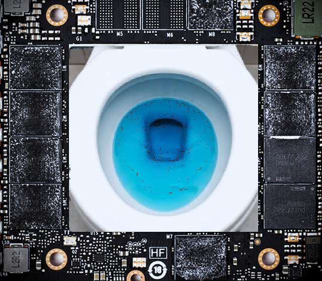

<div align="center">
  
  <h1>DirectPort</h1>
  <p><strong>Hardware-Fenced Inter-Process GPU Memory Conduit for Windows</strong></p>
  <p><em>Archived Predecessor Architecture // Retained for NT Handle &amp; Hardware Fence Benchmark Reference</em></p>
</div>

---

> [!NOTE]
> **ARCHIVE STATUS & SUCCESSOR ARCHITECTURE**  
> DirectPort is an archived milestone. It is retained to document the hardware-synchronized NT handle primitives and Direct2D/DirectComposition SMA bindings developed during this research phase.
> * **Successor for Memory Pipelines**: **[dpx](https://github.com/MansfieldPlumbing/DPX)** — Push-based, lock-free SPSC dataflow inference runtime with zero-copy UMA memory transit.
> * **Successor for Native Windows Runtime**: **[QuickPS](https://github.com/MansfieldPlumbing/QuickPS)** — Zero-dependency Windows runtime with in-memory `[Reflection.Emit]` COM vtables and WASAPI audio capture.

---

## 1. Architectural Scope & Retrospective

DirectPort solved a fundamental Windows graphics bottleneck: **sharing GPU memory between distinct operating system processes without CPU staging or host RAM loopbacks**.

By proxying DirectX 12 hardware fences through Windows NT named handles (`CreateSharedHandle` / `OpenSharedHandleByName`), producer processes signal GPU completion directly to consumer command queues. Consumers unblock at physical PCIe crossbar latency (**~170 ns**) rather than waiting for Windows thread scheduler quantum boundaries (1–15 ms).

### Plain Concession: The Frame & Video Paradigm

DirectPort was conceptualized around **textures, video frames, framebuffers, and camera streams**. It approached GPU IPC through the lens of video delivery (DirectX 11/12 textures, Media Foundation sources, display composition) rather than general tensor computation DAGs or push-based token dataflow. 

While highly effective for multi-process video multiplexing and real-time display compositing, the frame-based abstraction introduces unnecessary boundaries when applied to continuous machine learning workloads. Those lessons directly prompted the shift toward lock-free, double-buffered node isolation in **dpx**.

### Quarantining the Python Prototype

Early versions of DirectPort included Python bindings (`pybind11`), ONNX Runtime DirectML integrations, and NumPy buffer bridges. 

Tethering a sub-microsecond GPU IPC conduit to Python's Global Interpreter Lock (GIL) and runtime overhead proved to be an architectural mismatch. All Python bindings and demonstration scripts have been strictly quarantined under [`legacy/python/`](legacy/python/). The core systems engineering lives in native C++ and PowerShell SMA.

---

## 2. Spout for D3D12 — Modernized Hardware Crossbar

DirectPort fills the role of **Spout (and macOS Syphon) natively for DirectX 12**:

| Feature | Legacy Spout / Syphon | DirectPort D3D12 |
| :--- | :--- | :--- |
| **API Target** | D3D9Ex / D3D11 DXGI 1.0 Handles | Native D3D12 / DXGI 1.6 NT Security Handles |
| **Cross-Process Sync** | `Flush()` / CPU spinlocks (tears or stalls) | `ID3D12Fence` hardware crossbar wait (~170 ns) |
| **CPU Overhead** | 5%–15% CPU burned in synchronization | **0.0% CPU** (handled entirely on GPU command processor) |
| **Audio Conduit** | None (requires virtual audio cable / Dante) | **Synchronized A/V** (WASAPI float PCM ring buffer) |
| **Kernel Namespace Thrash** | Constant polling on `OpenFileMapping` | Decoupled 3-second UDP beacon (loopback zero-firewall default) |
| **Window & Backdrop** | Standard Win32 frame | Windows 11 Mica Alt (`DWMSBT_TABBEDWINDOW`) |

---

## 3. Unified Binary & System Tray Service (`DirectPort.exe`)

The codebase compiles into a single, compact **499 KB unmanaged Windows AMD64 executable** (`DirectPort.exe`) featuring a linear execution graph and zero-flash mode switching.

```text
[Input Acquire]                 [Graph Composition]              [Present & Sync]
  ├── HLSL Dynamic Compiler  ─┐   ├── Backbuffer Direct Copy ──┐   ├── ExecuteCommandLists
  ├── Precompiled CSO Bytecode│   ├── Textured Quad Blit     │   ├── Signal Hardware Fence
  ├── Live UVC Camera Stream ─┼──>├── 4-Way Multi-Tile Grid  ┼──>├── Flip-Discard Present
  └── NT Crossbar Handle Wait │                                │   └── Waitable Swapchain Sync
                              │                                │
                       [WASAPI Loopback]               [WASAPI Render]
```

### Modes & Hotkeys

Modes can be set via command-line flags or toggled dynamically in the running window:

* **`F1` — Producer (HLSL Shader)**: Evaluates dynamic shaders (embedded plasma fallback or loose `shaders/plasma.hlsl`). Press **`F5`** for instant live hot-reload without restarting.
* **`F2` — Producer (Live Camera)**: Enumerates physical UVC webcams (Media Foundation `IMFSourceReader`), capturing directly into aligned VRAM buffers. Press **`C`** to cycle cameras.
* **`F3` — Consumer (Auto-Listen)**: Automatically discovers running producers, attaches to shared NT handles, and queues GPU hardware waits. Displays active blueprint status when scanning.
* **`F4` — Multiplexer (256-Camera Blueprint)**: Raw badass D3D12 multiplexer from `DirectPort-Legacy`. Dynamically computes $N \times M$ grid viewports (`cols = ceil(sqrt(count))`), arranges up to 256 simultaneous streams, produces the composited grid as `DirectPort_Multiplexer`, and blits local preview.
* **`C` — Cycle Camera**: Cycles through all enumerated physical and virtual video capture devices.
* **`M` — Audio Toggle**: Mutes or unmutes the synchronized WASAPI loopback audio stream.
* **`Esc` / `Q` — Exit**: Clean shutdown releasing all NT object handles.

### Windows 11 System Tray & Acrylic Context Menu

`DirectPort.exe` lives in the Windows notification area (system tray). Right-clicking the tray icon or the window opens a dark Mica Alt context menu that lists every connected webcam by name and switches modes without command-line flags.

---

## 4. Discovery Protocol: Loopback vs. LAN

To eliminate the kernel namespace polling thrash of legacy prototypes (which hammered `OpenFileMappingW` inside inner message loops), DirectPort uses a non-blocking UDP beacon (`port 3987`):

* **Loopback Mode (Default)**: Binds to `127.0.0.1`. Windows Firewall **never** prompts or warns for loopback sockets. Local inter-process communication (between OBS, TouchDesigner, Unreal, Unity, and DirectPort) operates with zero user friction.
* **LAN Broadcast (`--lan`)**: Emits to `255.255.255.255:3987` for cross-machine discovery on a local network.
* **Cadence**: Broadcasts an initial announcement on frame 1, followed by a quiet 3-second heartbeat. Connected consumers execute zero network calls during active rendering.

---

## 5. Ecosystem Interop: OBS Studio & WebView2

### OBS Studio Source Plugin (High Tractability)
OBS Studio's graphics subsystem (`libobs-d3d11`) exposes `gs_texture_open_shared()` and `gs_texture_create_from_d3d11_texture()`. A native DirectPort OBS source plugin is ~150 lines of C:
1. Producer writes D3D12 texture and signals shared NT fence.
2. OBS plugin opens NT handle, queues `dp12_queue_wait()`, and blits the texture into the OBS canvas.
3. Audio from the WASAPI shared ring buffer streams directly into `obs_source_output_audio()`.

### WebView2 Consumer
Chromium's sandboxing blocks arbitrary Win32 NT handle imports into WebGL/WebGPU. Two clean integration paths exist:
1. **Media Foundation Virtual Camera (VirtuaCam)**: Route DirectPort frames into VirtuaCam's Media Foundation source. Any WebView2, Electron, or Chrome window consumes it at 60 FPS via standard HTML5 `<video>` / `navigator.mediaDevices.getUserMedia()`.
2. **Native Host Injection**: A Win32 host application embedding WebView2 renders DirectPort in D3D12 and injects video via custom local WebRTC streams.

---

## 6. Repository Layout

```text
DirectPort/
├── docs/
│   ├── directport.png               # Toilet-in-VRAM logo badge
│   └── directport.ico               # Multi-resolution Win32 application icon
├── shaders/
│   ├── plasma.hlsl                  # Procedural dynamic test shader
│   └── smpte.hlsl                   # SMPTE 75% broadcast color bars
├── src/
│   ├── apps/
│   │   └── DirectPort/              # Unified application binary
│   │       ├── DirectPort.cpp       # Single-window linear DAG & message pump
│   │       ├── DirectPort.rc        # Resource script with embedded icon
│   │       ├── Menu.h               # Mica Alt tray menu
│   │       └── Menu.cpp
│   ├── sdk/                         # Clean C/C++ transport layer
│   │   ├── directport.h             # Core DirectPort C-ABI API
│   │   ├── DirectPort_Discovery.h   # Non-blocking UDP beacon & listener
│   │   ├── DirectPort_Audio.h       # WASAPI loopback capture & ring buffer
│   │   ├── DirectPort_Camera.h      # Media Foundation UVC webcam capture
│   │   ├── directportd3d12.cpp      # D3D12 NT handle & fence implementation
│   │   └── directportd3d11.cpp      # D3D11 compatibility layer
│   ├── sma/                         # DirectPortSMA: Native PowerShell / SMA engine
│   ├── ipc/                         # Windows Shell & Context Menu IPC
│   └── presentation/                # DirectComposition visual surfaces
└── legacy/                          # Historical prototypes (quarantined)
    ├── Examples/                    # Early polling-based prototypes
    └── python/                      # Quarantined Python bindings & scripts
```

---

## License

MIT License. See [LICENSE](LICENSE) for details.
